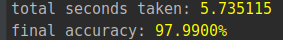
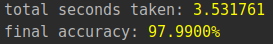
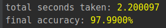
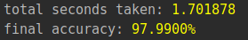
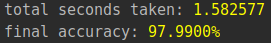
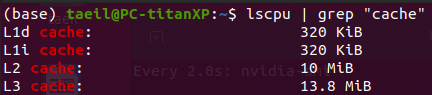
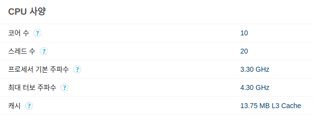

# STAIhw1-inferenceoncpu-pytorch
This repo is for "special topics on AI" course homework 1.

It tests network speed on cpu with numpy and python with single and multiple batches.

A model is with two hidden layers.

## train network on pytorch with GPU
```
python train_mnist.py
```
This will save "params.pth", a file of the model's state dictionary.

You can specify some arguments to tweak the experiment; otherwise it will run with default settings.

## Infer network with saved parameters on cpu
```
BATCH_SIZES="1 32 64"
python infer_mnist.py --batch_sizes ${BATCH_SIZES}
```
This will run inference on cpu with saved "params.pth" and show the time taken for inference.

Batchwise multiplication is implemented using numpy [ensum](https://numpy.org/doc/stable/reference/generated/numpy.einsum.html).

## Results
Following pictures show the run time and accuracy (accuracy should be the same since it loaded same parameters) for batch sizes 4, 8, 16, 32, 64 respectively.











## Question
My cpu's specification is as following...





cpus that have cache memory of 8MB is following... (intel i5 series)


